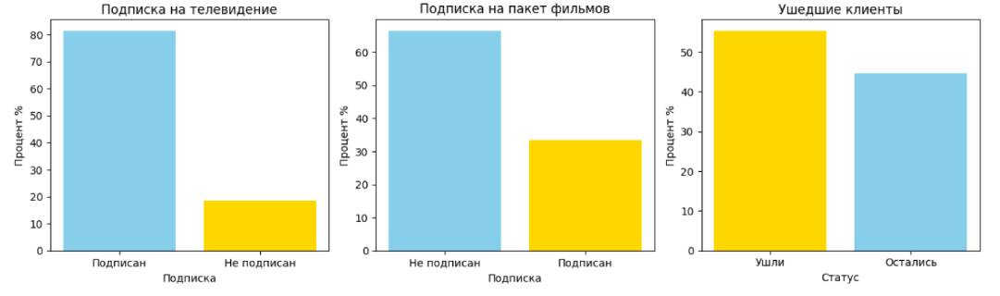
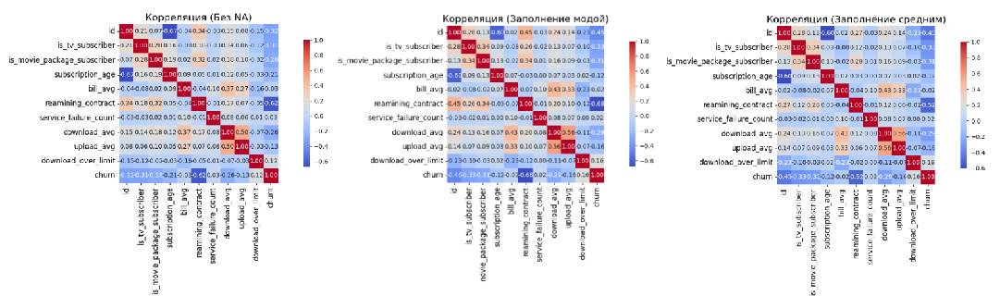
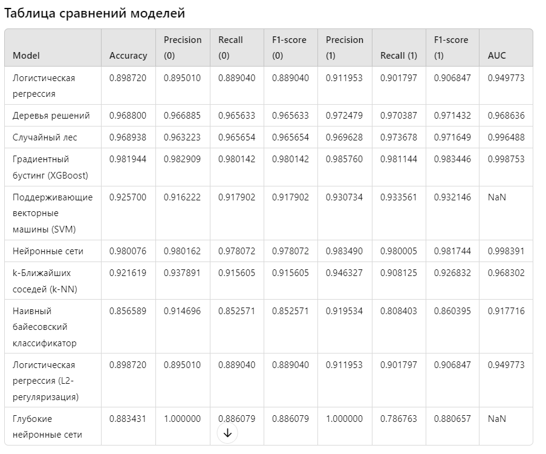

# Прогнозування Відтоку Клієнтів для Телекомунікаційної компанії

## Опис проекту

Проект спрямовано створення моделі машинного навчання для прогнозування ймовірності відтоку клієнтів телекомунікаційної компанії з урахуванням історичних даних. Мета — допомогти компанії виявити клієнтів, схильних до відтоку та мінімізувати втрати.

## Аналіз даних

Ми зробили аналіз даних. Дані про клієнтів телекомунікаційної компанії були завантажені, перевірені на наявність перепусток, дублікатів та негативних значень. Основні статистичні характеристики розраховані, дані візуалізовані виявлення закономірностей і аналізу розподілів. Ці кроки допомогли підготувати дані для подальшого моделювання та покращити розуміння ключових факторів, що впливають на відтік клієнтів.


## Опис даних

Набір даних складається з 72,274 записів та 11 стовпців, що містять інформацію про клієнтів телекомунікаційної компанії. Структура даних така:

- **id**: унікальний ідентифікатор клієнта.
- **is_tv_subscriber**: індикатор передплати телебачення (1 - так, 0 - ні).
- **is_movie_package_subscriber**: індикатор підписки на пакет фільмів (1 – так, 0 – ні).
- **subscription_age**: вік передплати у роках.
- **bill_avg**: середній рахунок клієнта.
- **remaining_contract**: термін контракту, що залишився (значення пропущено для 21,572 клієнтів).
- **service_failure_count**: кількість збоїв в обслуговуванні.
- **download_avg**: середня швидкість завантаження.
- **upload_avg**: середня швидкість вивантаження (значення пропущено для 381 клієнта).
- **download_over_limit**: індикатор перевищення ліміту завантаження (1 – так, 0 – ні).
- **churn**: індикатор відтоку клієнтів (1 – пішов, 0 – залишився).

### Статистичні характеристики

- Середній вік передплати: 2.45 року
- середній рахунок клієнта: 18.94
- відсоток клієнтів з підпискою на телебачення: 81.53%
- Відсоток клієнтів із підпискою на пакет фільмів: 33.46%
- Відсоток клієнтів: 55.41%

### Пропуски та аномалії

- У стовпці **remaining_contract** 21,572 записи мають перепустки.
- У стовпці **subscription_age** 1 значення негативне, що потребує додаткової перевірки.

### Дублікати та негативні значення

- Дублікатів у даних не виявлено.
- Негативних значень у більшості стовпців немає, крім одного випадку у **subscription_age**.

## Підготовка та очистка даних

Ми підготували та очистили дані, створивши кілька наборів для порівняння.

- **data_no_na**: Видалено всі рядки з перепустками.
- **data_mode**: Перепустки у стовпцях заповнені модою.
- **data_mean**: Перепустки заповнені середніми значеннями.

Ми підготували та очистили дані, створивши кілька наборів для порівняння.

Видалення перепусток зменшило розмір даних на 30%, що може вплинути на результати, оскільки розподіл цільової змінної churn став спотвореним. Заповнення перепусток модою та середніми значеннями дозволило зберегти початковий обсяг даних і не змінило середнє значення churn. Кореляції з churn залишилися більш вираженими в датасеті із заповненням модою, що допомагає зберегти важливу інформацію.

У результаті було обрано метод заповнення перепусток модою, оскільки він зберігає структуру даних і важливі залежності.



## Оцінка моделей машинного навчання

Ми оцінили декілька моделей машинного навчання. Найкращі результати показали XGBoost та Нейронні мережі, демонструючи високі показники точності та AUC. Випадковий ліс і Дерева рішень теж виявилися ефективними, але трохи поступаються AUC. Логістична регресія та SVM показали збалансовані результати, а k-NN та Наївний байєсівський класифікатор виявилися менш успішними.

Переважною моделлю для завдання є XGBoost, який показав найкращі результати



## Інструкції із запуску проекту

### Через Docker

1. **Скачайте файли проекту**.
 https://github.com/basilegupov/DataScienceProject/tree/main

2. **Запустіть Docker Desktop**.

3. **У консолі виконайте команди**:

 ``` bash
 docker-compose build --no-cache
 docker-compose up

 ````

4. Після цього проект буде доступний за адресою http://localhost:8000/.

5. **Повторний запуск через Запустіть Docker Desktop**.

### Через віртуальне середовище

1. Завантажте файли проекту https://github.com/basilegupov/DataScienceProject/tree/main.

2. Запустіть віртуальне середовище за допомогою команди pipenv shell
 Переконайтеся, що ви знаходитесь у потрібній директорії.

3. Встановіть необхідні бібліотеки: pipenv install django joblib scikit-learn xgboost

4. Запустіть сервер за допомогою команди python manage.py runserver

5. Після цього сервер повинен запуститись, і ви зможете отримати доступ до свого Django-проекту через веб-браузер за адресою: http://127.0.0.1:8000/.

- Docker дозволяє ізолювати проект у контейнері та автоматизує налаштування залежностей та оточення.
- Віртуальне середовище pipenv використовується для локального настроювання оточення без контейнеризації, де всі бібліотеки встановлюються у віртуальному середовищі Python.

Обидва варіанти запускають той самий проект, але Docker пропонує більш ізольоване і універсальне рішення для розгортання.


